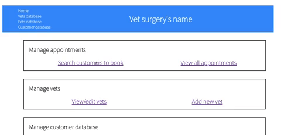

# code_clan_python_project

## A web app project built in python3 with Flask to emulate a vet's surgery system.  Dealing with vets, pets, owners, and appointments.
### to run..
1. create db
`createdb vets`
2. connect sql file
`psql -d vets -f /db/vets.sql`
3. run flask on local host
`flask run`

seed data for 5 vets, 100 owners and 150 pets created along with the tables in the sql file

